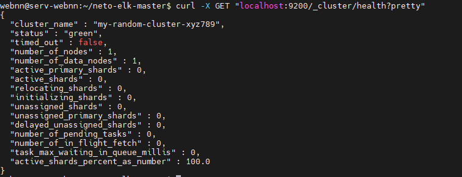
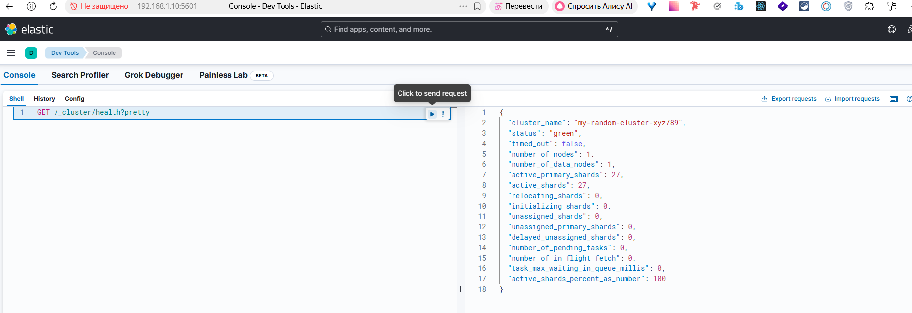
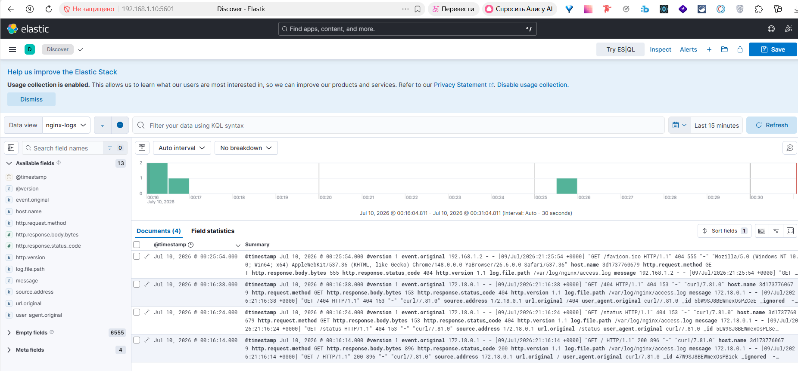
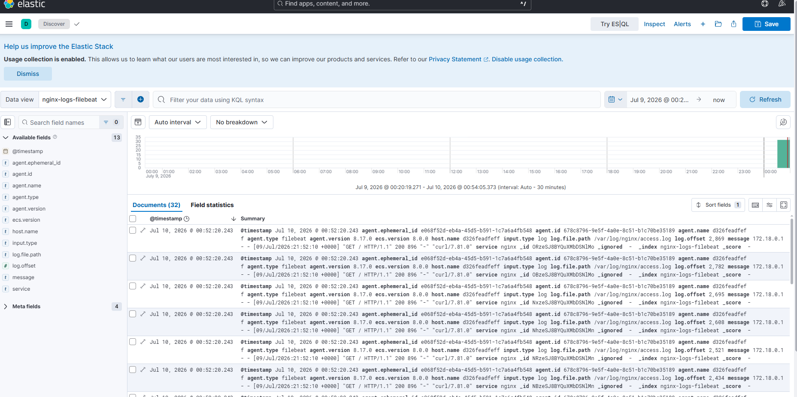

Домашнее задание к занятию «ELK» Ражев М.Н

## Задание 1. Elasticsearch

Установите и запустите Elasticsearch, после чего поменяйте параметр cluster_name на случайный.

Приведите скриншот команды 'curl -X GET 'localhost:9200/_cluster/health?pretty', сделанной на сервере с установленным Elasticsearch. Где будет виден нестандартный cluster_name.  
 
**Ответ**
docker-compose  \files\1-docker-compose.yml

Скриншот 1: с результатом

-----------------------------------------------------------------------------------

## Задание 2. Kibana

1. Установите и запустите Kibana.

Приведите скриншот интерфейса Kibana на странице http://<ip вашего сервера>:5601/app/dev_tools#/console, где будет выполнен запрос GET /_cluster/health?pretty.
  
**Ответ**
docker-compose  \files\2-docker-compose.yml

Скриншот 2: с результатом

-----------------------------------------------------------------------------------

Задание 3. Logstash

Установите и запустите Logstash и Nginx. С помощью Logstash отправьте access-лог Nginx в Elasticsearch.

Приведите скриншот интерфейса Kibana, на котором видны логи Nginx.
  
**Ответ**
docker-compose  \files\3-docker-compose.yml

Скриншот 3: с результатом

-----------------------------------------------------------------------------------

## Задание 4. Filebeat.

Установите и запустите Filebeat. Переключите поставку логов Nginx с Logstash на Filebeat.

Приведите скриншот интерфейса Kibana, на котором видны логи Nginx, которые были отправлены через Filebeat. 
  
**Ответ**
docker-compose  \files\docker-compose.yml

Скриншот 4: 

