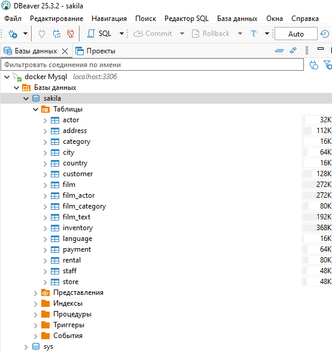
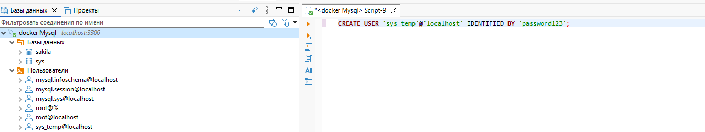
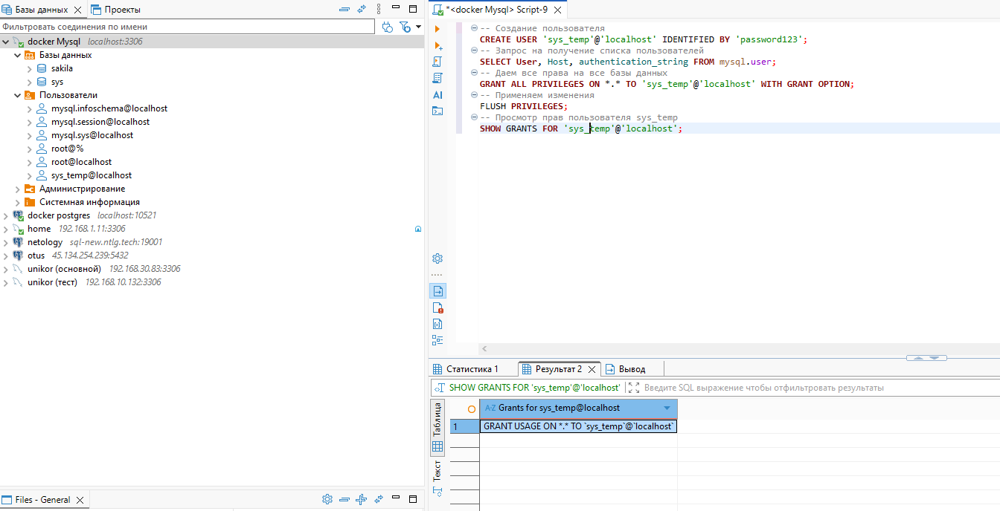
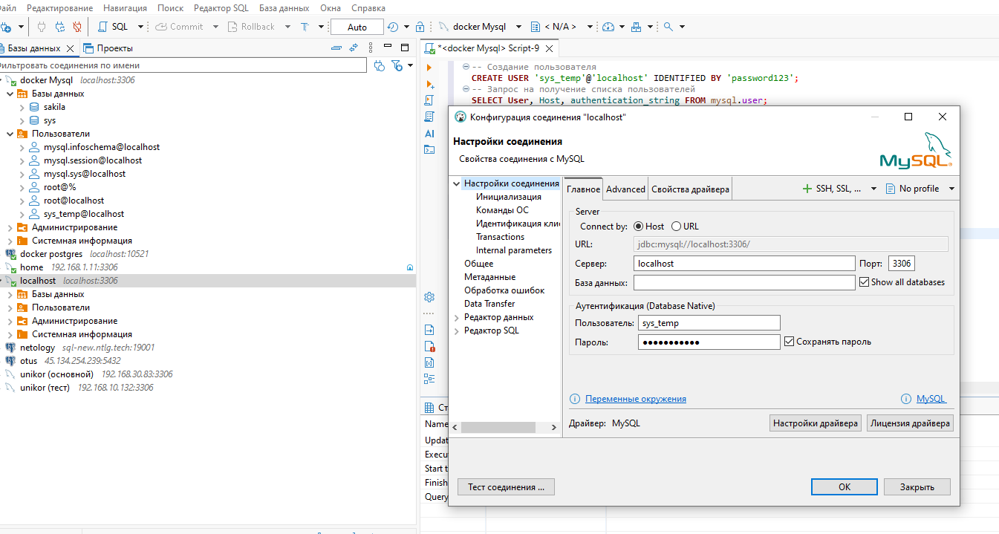
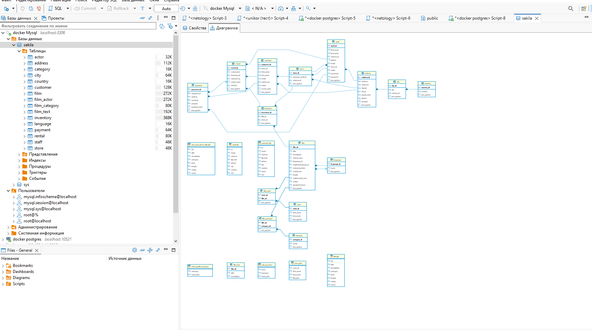

Домашнее задание к занятию «Введение в SQL» Ражев М.Н

## Задание 1.

1.1. Поднимите чистый инстанс MySQL версии 8.0+. Можно использовать локальный сервер или контейнер Docker.
1.2. Создайте учётную запись sys_temp.
1.3. Выполните запрос на получение списка пользователей в базе данных. (скриншот)
1.4. Дайте все права для пользователя sys_temp.
1.5. Выполните запрос на получение списка прав для пользователя sys_temp. (скриншот)
1.6. Переподключитесь к базе данных от имени sys_temp.

Для смены типа аутентификации с sha2 используйте запрос:

ALTER USER 'sys_test'@'localhost' IDENTIFIED WITH mysql_native_password BY 'password';

1.7. По ссылке скачайте дамп базы данных.
1.8. Восстановите дамп в базу данных.
1.9. При работе в IDE сформируйте ER-диаграмму получившейся базы данных. При работе в командной строке используйте команду для получения всех таблиц базы данных. (скриншот)
  
**Ответ**

1.1 Поднятие чистого инстанса MySQL 8.0+ в Docker

1.3 Получение списка пользователей

1.5 Получение списка прав для sys_temp

1.6. Подключение к базе данных от имени sys_temp.

1.7 - 1.9 

-----------------------------------------------------------------------------------

## Задание 2.
Задание 2
Составьте таблицу, используя любой текстовый редактор или Excel, в которой должно быть два столбца: в первом должны быть названия таблиц восстановленной базы, во втором названия первичных ключей этих таблиц. Пример: (скриншот/текст)
  
**Ответ**

