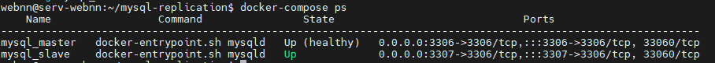
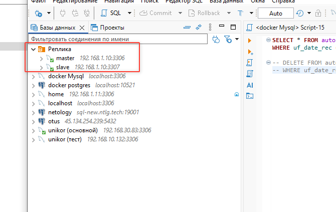

Домашнее задание к занятию «Репликация и масштабирование. Часть 1» Ражев М.Н

## Задание 1.
На лекции рассматривались режимы репликации master-slave, master-master, опишите их различия.
 
**Ответ**

Master-Slave (Однонаправленная)
Аспект	Описание
Запись	Только на мастер
Чтение	Мастер + слейвы
Направление	Однонаправленное (мастер → слейв)
Сложность	Низкая
Конфликты	Отсутствуют
Отказ мастера	Запись невозможна
Пример	Веб-приложения с высокой нагрузкой на чтение

Master-Master (Двунаправленная)
Аспект	Описание
Запись	На оба мастера
Чтение	С любого мастера
Направление	Двунаправленное (мастер ↔ мастер)
Сложность	Высокая
Конфликты	Возможны (требуют разрешения)
Отказ мастера	Второй продолжает работу
Пример	Критические системы 24/7

Главные отличия в 3 пунктах:

Запись данных
Master-Slave: только 1 мастер
Master-Master: 2+ мастеров

Отказоустойчивость
Master-Slave: при падении мастера запись останавливается
Master-Master: при падении одного мастера второй продолжает работу

Сложность
Master-Slave: простая настройка
Master-Master: сложная, требует решения конфликтов
-----------------------------------------------------------------------------------

## Задание 2.

Выполните конфигурацию master-slave репликации, примером можно пользоваться из лекции.

**Ответ**
docker-compose  \mysql-replication\docker-compose.yml

Скриншот статусы 4: 

Скриншот подключены в dbeaver: 

