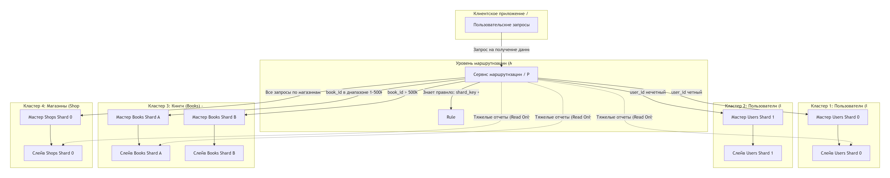

Домашнее задание к занятию «SQL. Часть 2» Ражев М.Н

## Задание 1.

Опишите основные преимущества использования масштабирования методами:

- активный master-сервер и пассивный репликационный slave-сервер;
- master-сервер и несколько slave-серверов;
  
**Ответ**

1. Активный master-сервер и пассивный репликационный slave-сервер

Это классическая схема "Master-Slave" (один ведущий, один ведомый).

Основные преимущества:

- Отказоустойчивость (Failover): Это главный плюс. В случае выхода из строя мастер-сервера (аппаратная поломка, сбой сети), администратор может переключить трафик на слейв. Время простоя (downtime) сокращается до минимума (минуты или секунды).

- Резервное копирование без нагрузки: Можно делать бэкап (дамп) базы данных не с мастера, а со слейва. Это снимает нагрузку с процессора и дисковой системы основного сервера, который занят обслуживанием клиентских запросов.

- Балансировка чтения (Read Scaling): Даже при наличии одного слейва, вы можете направить на него тяжелые аналитические SELECT-запросы, отчеты или выгрузки данных, освобождая мастер для операций записи (INSERT/UPDATE/DELETE).

- Простота управления: Легко настраивается, легко мониторить состояние репликации (Lag).

2. Master-сервер и несколько slave-серверов

Это та же схема, но с горизонтальным расширением количества реплик.

Основные преимущества (дополнительно к предыдущим):

- Масштабирование чтения (Read Scalability): Чем больше слейвов, тем больше одновременных читающих запросов вы можете обслуживать. Это идеально подходит для проектов с высоким трафиком (соцсети, новостные порталы), где чтений в 10–100 раз больше, чем записей.

- Геораспределение (Geo-redundancy): Реплики можно разместить в разных дата-центрах (ближе к пользователям в США, Европе, Азии). Это снижает задержки (латентность) для конечных пользователей.

- Специализация слейвов: Одну реплику можно использовать для генерации отчетов (тяжелые JOIN), вторую — для поиска (Full-Text Search), третью — для бэкапов, а четвертую — для продакшн-чтения. Это развязывает руки разработчикам.

- Каскадная репликация: Если слейвов слишком много, чтобы мастер успевал их обслуживать, можно настроить цепочку (Master -> Slave1 -> Slave2, Slave3), снизив нагрузку на сеть мастера.

-----------------------------------------------------------------------------------

## Задание 2.

Разработайте план для выполнения горизонтального и вертикального шаринга базы данных. База данных состоит из трёх таблиц:

- пользователи,
- книги,
- магазины (столбцы произвольно).

Опишите принципы построения системы и их разграничение или разбивку между базами данных.

**Ответ**

Принципы построения системы:

1. Вертикальное разделение (Vertical Partitioning):
- Так как таблицы слабо связаны между собой (у них нет огромных пересекающихся данных), мы разнесем их на разные физические кластеры. Это позволит масштабировать их независимо (например, если "Книг" стало 100 млн, мы увеличим мощность только этого кластера).

2 Горизонтальный шардинг (Horizontal Sharding / Hash Sharding):
- Самая большая таблица — Книги. Очевидно, что их будет миллионы/миллиарды. Мы разобьем их на несколько шардов (Shard 1, Shard 2) по хешу от ID книги (или по первой букве названия, но хеш лучше для равномерности).
- Таблицы Пользователи и Магазины тоже могут вырасти, поэтому мы заложим для них по 2 шарда (на будущее), но на старте они могут жить на одном сервере.

3. Сервис маршрутизации (Query Router): Клиентское приложение не обращается к базам напрямую. Оно идет в специальный "Роутер" (Middleware, например, ProxySQL, Vitess или свой микросервис), который смотрит на ключ шардирования и направляет запрос в нужный шард.

4. Репликация (Master-Slave): Для отказоустойчивости у каждого Мастера (шарда) будет как минимум один Слейв (реплика) для чтения и подстраховки.

Схема расположения (Блок-схема)

Система строятся по принципу "Shared-Nothing" (каждый шард живет на своем сервере/паре серверов и не знает о других). Связи между таблицами (Foreign Keys) на уровне БД не используются — они эмулируются на уровне приложения (через джойны в коде или денормализацию данных).
