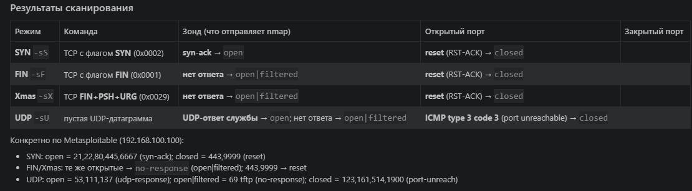

Домашнее задание к занятию «Базы данных» Ражев М.Н

## Задание 1.

 
**Ответ**

Скриншот 1: с результатом

-----------------------------------------------------------------------------------

## Задание 2.

  
**Ответ**

-----------------------------------------------------------------------------------

