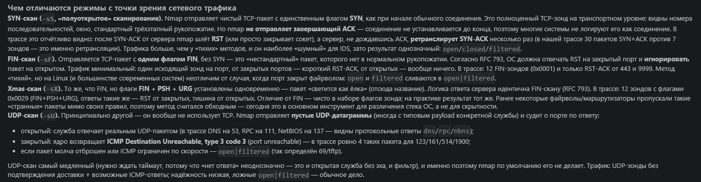
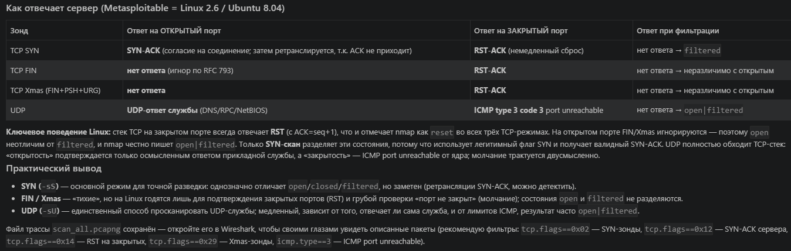

Домашнее задание к занятию «Базы данных» Ражев М.Н

## Задание 1.

 
**Ответ**

Скриншот 1: с результатом

=======
Домашнее задание к занятию «Уязвимости и атаки на информационные системы» Ражев М.Н

## Задание 1.

Скачайте и установите виртуальную машину Metasploitable: https://sourceforge.net/projects/metasploitable/.

Это типовая ОС для экспериментов в области информационной безопасности, с которой следует начать при анализе уязвимостей.

Просканируйте эту виртуальную машину, используя nmap.

Попробуйте найти уязвимости, которым подвержена эта виртуальная машина.

Сами уязвимости можно поискать на сайте https://www.exploit-db.com/.

Для этого нужно в поиске ввести название сетевой службы, обнаруженной на атакуемой машине, и выбрать подходящие по версии уязвимости.

Ответьте на следующие вопросы:
- Какие сетевые службы в ней разрешены?
- Какие уязвимости были вами обнаружены? (список со ссылками: достаточно трёх уязвимостей)

Приведите ответ в свободной форме.
 
**Ответ**

## Сетевые службы, разрешённые в Metasploitable 2

Машина работает по адресу __192.168.100.100__ в изолированной host-only сети. Полное сканирование портов (`nmap -sV -sC -O -p- --open`) выявило около тридцати открытых служб:

- __TP (21)__ — vsftpd 2.3.4 (допускает анонимный вход); дополнительный FTP на порту 2121 — ProFTPD 1.3.1;

- __SSH (22)__ — OpenSSH 4.7p1;

- __Telnet (23)__ — Linux telnetd;

- __SMTP (25)__ — Postfix smtpd (поддерживает устаревший SSLv2);

- __DNS (53)__ — ISC BIND 9.4.2;

- __HTTP (80)__ — Apache httpd 2.2.8 (Ubuntu) с mod_dAV/2;

- __RPC (111)__ — rpcbind;

- __Samba / NetBIOS (139, 445)__ — Samba smbd 3.X–4.X;

- __r-службы (512 exec, 513 login, 514 shell)__ — netkit-rsh;

- __Java RMI (1099)__ — GNU Classpath grmiregistry;

- __bindshell (1524)__ — преднамеренно открытый root-shell;

- __NFS (2049)__;

- __MySQL (3306)__ — 5.0.51a-3ubuntu5;

- __distccd (3632)__ — распределённый компилятор;

- __PostgreSQL (5432)__ — 8.3.0–8.3.7;

- __VNC (5900)__ — протокол 3.3;

- __X11 (6000)__;

- __IRC (6667, 6697)__ — UnrealIRCd;

- __AJP13 (8009)__ и __HTTP (8180)__ — Apache Tomcat/Coyote JSP 1.1;

- __Ruby DRb RMI (8787)__ — Ruby 1.8;

- набор динамических RPC-портов (mountd, nlockmgr, status, java-rmi — 40805/41996/54238/41116

Определённая ОС — Linux 2.6.9–2.6.33 (Ubuntu 8.04), имя NetBIOS — METASPLOITABLE.

Обнаруженные уязвимости

Среди множества слабостей машины три наиболее яркие подтверждены непосредственно на exploit-db.com — версии служб, определённые nmap, точно совпадают с уязвимыми версиями в базах эксплойтов:

1. __vsftpd 2.3.4 — Backdoor Command Execution__ (CVE-2011-2523). В архив с vsftpd 2.3.4 был заложен бэкдор: при отправке имени пользователя, оканчивающегося на `:)`, сервер открывает root-shell на порту 6200. Затронут FTP-сервис на порту 21. 👉 <https://www.exploit-db.com/exploits/17491>

2. __Samba 3.0.20 < 3.0.25rc3 — 'Username map script' Command Execution__ (CVE-2007-2447). При включённой опции `username map script` атакующий передаёт имя пользователя с метасимволами оболочки, что приводит к удалённому выполнению команд от root __без аутентификации__. Затронуты порты 139/445. 👉 <https://www.exploit-db.com/exploits/16320>

3. __UnrealIRCd 3.2.8.1 — Remote Downloader/Execute__ (CVE-2010-2075). В дистрибутив UnrealIRCd был вшит бэкдор: специальная команда `AB;` позволяет скачать и запустить на сервере произвольный файл (bindshell или реверс-шелл). Затронуты порты 6667/6697. 👉 <https://www.exploit-db.com/exploits/13853>

Дополнительно заслуживают внимания (помимо указанных трёх): ProFTPD 1.3.1, distccd RCE, Java/Ruby RMI-десериализация, PHP-CGI (CVE-2012-1823), слабые учётные данные Tomcat/PostgreSQL и открытый root-shell на порту 1524. Учётные данные машины по умолчанию — `msfadmin` / `msfadmin`.

-----------------------------------------------------------------------------------

## Задание 2.

=======
Проведите сканирование Metasploitable в режимах SYN, FIN, Xmas, UDP.

Запишите сеансы сканирования в Wireshark.

Ответьте на следующие вопросы:
- Чем отличаются эти режимы сканирования с точки зрения сетевого трафика?
- Как отвечает сервер?

Приведите ответ в свободной форме.

 
**Ответ**

=======
1. Результаты сканирования

2. 

3.

-----------------------------------------------------------------------------------

