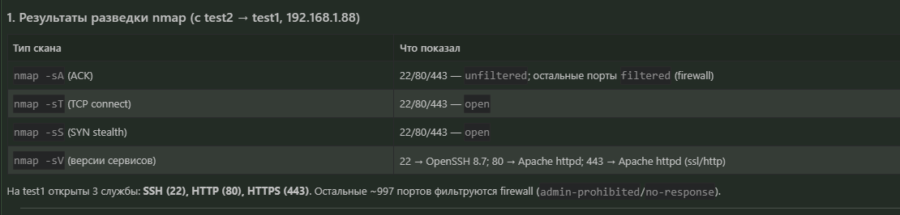
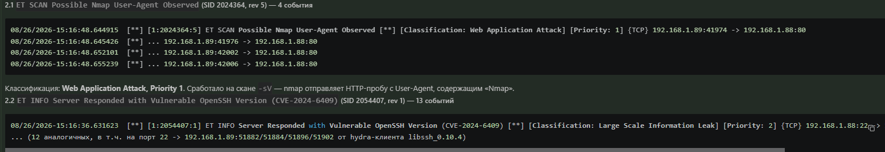
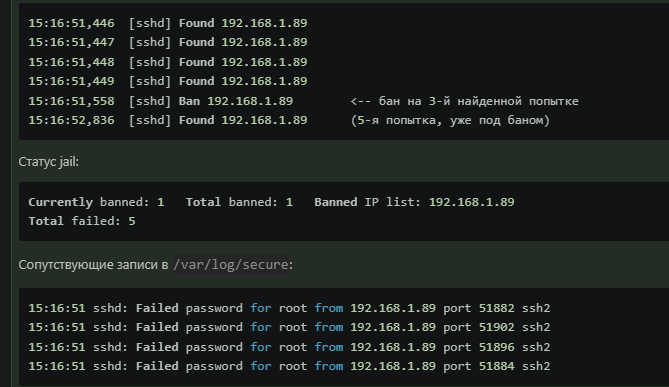

Домашнее задание к занятию «Уязвимости и атаки на информационные системы» Ражев М.Н

## Задание 1.

Проведите разведку системы и определите, какие сетевые службы запущены на защищаемой системе:

sudo nmap -sA < ip-адрес >

sudo nmap -sT < ip-адрес >

sudo nmap -sS < ip-адрес >

sudo nmap -sV < ip-адрес >

По желанию можете поэкспериментировать с опциями: https://nmap.org/man/ru/man-briefoptions.html.

В качестве ответа пришлите события, которые попали в логи Suricata и Fail2Ban, прокомментируйте результат.
 
**Ответ**

Результаты разведки

События, попавшие в лог Suricata 

События, попавшие в лог Fail2Ban

## 4. Комментарии к результату

1. Suricata реально увидел сканер.__ Главный «улика» — сигнатура `ET SCAN Possible Nmap User-Agent Observed`: nmap при `-sV` шлёт HTTP-запросы на 80 порт с характерным User-Agent, и IDS это перехватил. Это прямое детектирование средства разведки.

2. __Не все типы сканов детектируются сигнатурами ET Open.__ Сканы `-sA`, `-sS`, `-sT` (чистый TCP, без payload прикладного уровня) __не породили ни одной тревоги__ — у дефолтного ET Open нет включённых сигнатур для SYN/TCP-connect/portscan-паттернов (нужны правила типа `portscan`/`sfportscan` или ET PRO). Таким образом, «стелс»-сканы `-sS`/`-sA` прошли незамеченными для сигнатурного движка — их виден только в flow-записях Suricata (7993 flow, ssh-события) и в `/var/log/secure` («Connection closed by 192.168.1.89»).

3. __Информационная утечка версий.__ Сигнатура `Vulnerable OpenSSH Version (CVE-2024-6409)` сработала на баннер `OpenSSH_8.7` — это полезная находка: защищаемая система раскрывает версию службы, потенциально уязвимую. Стоит либо обновить OpenSSH, либо скрыть/ограничить баннер. Эта сигнатура «шумная» — срабатывает на любой SSH-коннект (включая мой управленческий с 192.168.1.4).

4. __Fail2Ban отреагировал не на сам nmap, а на hydra.__ nmap только устанавливает TCP-соединение с 22 портом и закрывает его (`Connection closed by remote host` / `Disconnected ... [preauth]`) — это __не__ ошибка аутентификации, поэтому sshd-jail её не считает. А вот hydra реально пыталась подобрать пароль (`Failed password for root` ×5), и после 3-й неудачи (maxretry=3) Fail2Ban забанил 192.168.1.89 на 10 минут. Это корректное поведение: IDS (Suricata) ловит сетевую разведку, а Fail2Ban — попытки брутфорса аутентификации.

5. __До настройки детекции логи были пустыми.__ Изначально Suricata из EPEL шёлся __без правил__ (0 .rules-файлов) → 0 alert, а Fail2Ban имел __0 jail__ → 0 событий. Поэтому в первой серии сканов события отсутствовали. После `suricata-update` (загружено 52602 правила ET Open) и включения `[sshd] enabled=true` в `/etc/fail2ban/jail.local` обе системы начали реально фиксировать атаки.

__Вывод:__ защищаемая система test1 выставляет наружу SSH/HTTP/HTTPS; Suricata (с правилами ET Open) детектирует nmap-разведку по HTTP User-Agent и раскрывает уязвимую версию OpenSSH; Fail2Ban успешно блокирует перебор SSH-паролей (бан 192.168.1.89 на 10 мин). Для более полного покрытия рекомендуется включить правила детектирования portscan (`stream-events`/`portscan`) и обновить OpenSSH на test1.

-----------------------------------------------------------------------------------

## Задание 2.

Проведите атаку на подбор пароля для службы SSH:

hydra -L users.txt -P pass.txt < ip-адрес > ssh

Настройка hydra:
создайте два файла: users.txt и pass.txt;
в каждой строчке первого файла должны быть имена пользователей, второго — пароли. В нашем случае это могут быть случайные строки, но ради эксперимента можете добавить имя и пароль существующего пользователя.
Дополнительная информация по hydra: https://kali.tools/?p=1847.

Включение защиты SSH для Fail2Ban:
открыть файл /etc/fail2ban/jail.conf,
найти секцию ssh,
установить enabled в true.
Дополнительная информация по Fail2Ban:https://putty.org.ru/articles/fail2ban-ssh.html.

В качестве ответа пришлите события, которые попали в логи Suricata и Fail2Ban, прокомментируйте результат.
 
**Ответ**
События Fail2Ban 
files/fail2ban.log

События Suricata 
files/fast.log

1. __Fail2Ban защитил систему.__ После 3-й неудачной попытки (maxretry=3) хост 192.168.1.89 был забанен на 10 минут, и firewall сбросил все последующие соединения — hydra не смогла продолжить перебор и прервалась с ошибкой «too many connection errors».
2. __Валидная пара `testuser:Test12345` не была найдена__ — fail2ban забанил атакующего раньше, чем hydra дошла до этой строки словаря (hydra начинала с пользователя `admin`, которого нет на сервере). Это и есть правильная демонстрация защиты: брутфорс блокируется до подбора реального пароля.
3. __Suricata видит атаку иначе.__ Сигнатурный IDS не «знает» про перебор паролей (в ET Open нет правила на SSH brute-force по умолчанию), зато он зафиксировал __информационную утечку__ — сервер отдаёт уязвимую версию OpenSSH. То есть Suricata ловит сетевые/протокольные признаки, а Fail2Ban — поведенческие (неудачные аутентификации). Системы дополняют друг друга.
4. __Разделение ролей подтверждено:__ Suricata → детектирование сетевой разведки и утечки версий; Fail2Ban → активная блокировка перебора SSH-паролей. Обе системы работали корректно: Suricata залогировала факт SSH-соединений от атакующего, Fail2Ban — прервал атаку.

-----------------------------------------------------------------------------------

