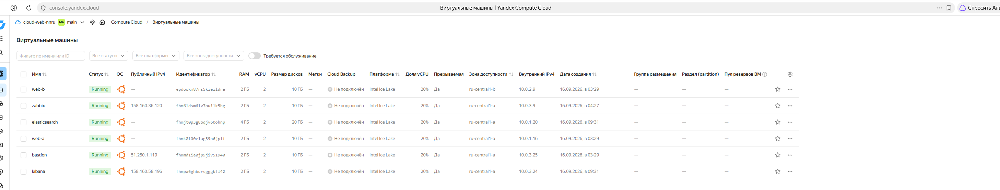

http://51.250.4.53/ сайт
http://51.250.4.53:8080/ веб-интерфейс Zabbix
http://51.250.4.53:5601/ веб-интерфейс Kibana 

Все файлы проекта лежат
files\project

Виртуальные машины развёрнутые в Яндекс Облаке.

# Общий план: что сделано в проекте

## 1. Что это за проект

Учебный стенд в Yandex Cloud для дипломной работы. Стенд разворачивается и настраивается
целиком программно, без ручных действий в веб-консоли:

* **Terraform** создаёт виртуальные машины, сети, группы безопасности, балансировщик
  и расписание резервного копирования;
* **Ansible** устанавливает и настраивает программы на машинах: nginx, Zabbix, Elasticsearch,
  Kibana, Filebeat.

---

## 2. Как стенд выглядит сейчас

Шесть виртуальных машин, одна сеть, разделённая на приватные и публичные подсети.

| ВМ | Что на ней | Подсеть | Внутренний адрес | Публичный адрес |
|---|---|---|---|---|
| `bastion` | точка входа по SSH | публичная public-a | 10.0.3.25 | статический **51.250.1.119** |
| `web-a` | nginx + сайт | приватная private-a | 10.0.1.16 | нет |
| `web-b` | nginx + сайт | приватная private-b | 10.0.2.9 | нет |
| `elasticsearch` | Elasticsearch 8.19 | приватная private-a | 10.0.1.20 | нет |
| `zabbix` | Zabbix 7.0 + база + веб-интерфейс | публичная public-a | 10.0.3.9 | динамический 158.160.36.120 |
| `kibana` | Kibana 8.19 | публичная public-a | 10.0.3.24 | динамический 158.160.58.196 |

Наружу пользователь видит только балансировщик — **51.250.4.53**:

| Адрес | Что открывается |
|---|---|
| `http://51.250.4.53/` | сайт (отдают web-a и web-b, по очереди) |
| `http://51.250.4.53:8080/` | веб-интерфейс Zabbix |
| `http://51.250.4.53:5601/` | веб-интерфейс Kibana (поиск по журналам nginx) |

Машины внутреннего контура (оба веб-сервера и Elasticsearch) публичных адресов не имеют
вообще: в интернет они ходят через NAT-шлюз, а заходят на них только через bastion.

---

## 3. Что делалось, по шагам

### Шаг 1. Два веб-сервера с nginx и балансировщик

Созданы две веб-машины в разных зонах доступности — так, чтобы выход из строя одной зоны
не ронял сайт. Обе без публичных адресов. Создан L7-балансировщик: он принимает запросы
из интернета и распределяет их между веб-серверами, а раз в пару секунд проверяет, что
каждый из них отвечает. На машины через Ansible установлен nginx и выложен статичный сайт —
содержимое обеих машин одинаковое.

Отдельно пришлось завести подсети для узлов балансировщика **без** маршрута по умолчанию:
по документации Yandex Cloud доступ к ресурсу через публичный адрес работает только тогда,
когда в подсети нет маршрута `0.0.0.0/0` — иначе трафик уходит в NAT-шлюз и адрес «не слышно».

### Шаг 2. Мониторинг: Zabbix

Создана машина с Zabbix 7.0 (сервер + PostgreSQL + веб-интерфейс). На каждую машину стенда
поставлен Zabbix-агент, сервер опрашивает их по внутренним именам `*.ru-central1.internal`.
Сделаны дашборды по принципу USE (загрузка, насыщение, ошибки) для процессора, памяти,
дисков, сети и HTTP-запросов к сайту, на графики выставлены пороги — при выходе за порог
Zabbix показывает проблему.

### Шаг 3. Сбор журналов nginx: Elasticsearch + Filebeat + Kibana

Созданы две машины: Elasticsearch (хранилище журналов) и Kibana (поиск и дашборды по ним).
На веб-серверы установлен Filebeat: он читает `access.log` и `error.log` nginx и отправляет
их в Elasticsearch. В Kibana загружены готовые дашборды по журналам nginx.

### Шаг 4. Сеть: приватные и публичные подсети, bastion, NAT

* веб-серверы и Elasticsearch — во **внутреннем контуре**, без публичных адресов, в интернет
  ходят через NAT-шлюз;
* Zabbix, Kibana и узлы балансировщика — в **публичной подсети**;
* вместо одной группы безопасности «разрешить всё внутри сети» у каждого сервиса теперь своя
  группа, где открыты только нужные порты и только из нужных подсетей;
* **bastion** — единственная машина, доступная из интернета, и на ней открыт ровно один
  порт SSH. Через неё Ansible подключается к машинам внутреннего контура (ProxyCommand),
  а внутрь она ходит сама.

### Шаг 5. Резервное копирование

Создано расписание снимков дисков: **каждый день в 03:00 UTC (06:00 по Москве)** Cloud снимает
копию загрузочного диска всех шести машин, и **каждый снимок живёт неделю** — потом удаляется
автоматически. Отдельного скрипта очистки не нужно, всё делает сам Cloud.

---

## 4. Как это проверить

# сайт, Zabbix и Kibana — через балансировщик
curl -s -o /dev/null -w "%{http_code}\n" http://51.250.4.53/        
curl -s http://51.250.4.53/ | grep -o "Дипломная.*h1."              
curl -s -o /dev/null -w "%{http_code}\n" http://51.250.4.53:8080/   
curl -s http://51.250.4.53:5601/api/status | head -c 80

## 5. Как всем управлять

# инфраструктура
terraform plan            # показать, что изменится (сейчас — No changes)
terraform apply           # применить

# настройка машин
ansible-playbook site.yml               # nginx и сайт на веб-серверах
ansible-playbook nginx-metrics.yml      # метрики nginx для Zabbix
ansible-playbook zabbix-server.yml      # Zabbix-сервер
ansible-playbook zabbix-agent.yml       # агенты на всех машинах
ansible-playbook zabbix-dashboards.yml  # узлы, пороги, графики, дашборды
ansible-playbook elasticsearch.yml      # Elasticsearch
ansible-playbook kibana.yml             # Kibana
ansible-playbook filebeat.yml           # Filebeat на веб-серверах

