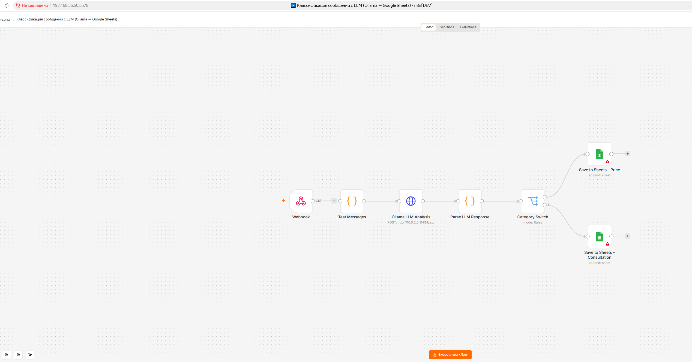
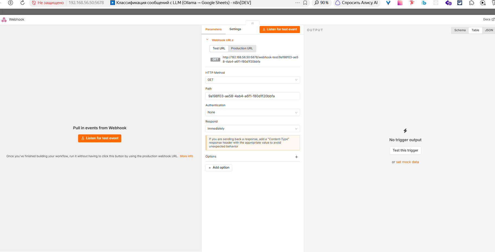
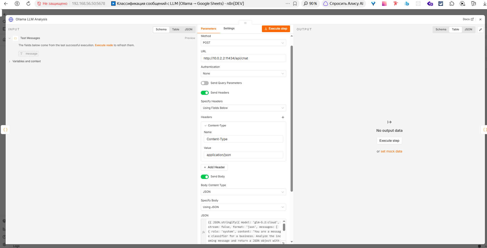
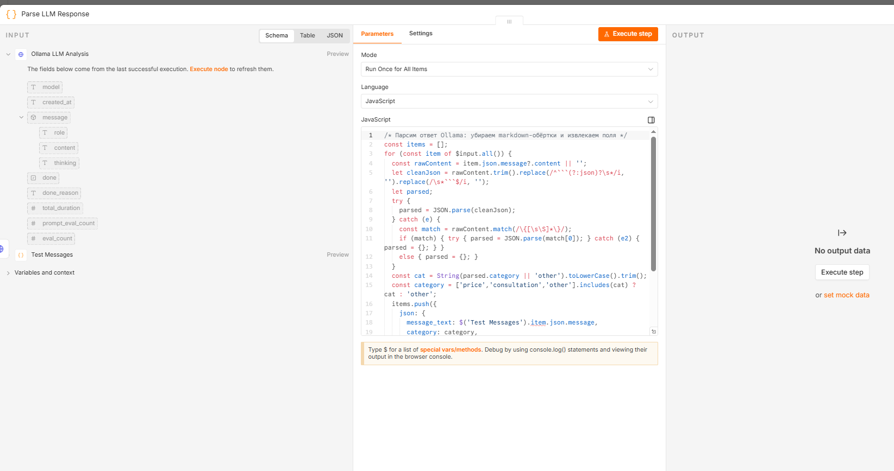
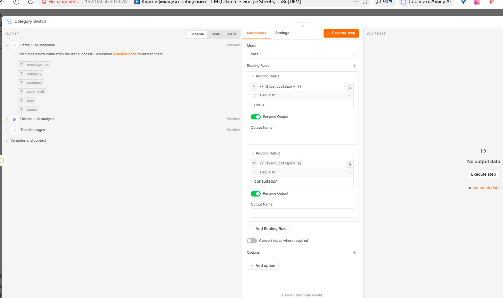
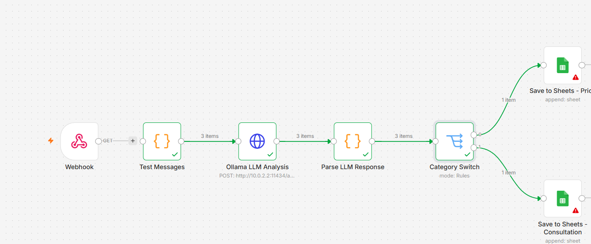

Домашнее задание к занятию «Сборка простого AI-агента в n8n для классификации входящих обращений» Ражев М.Н

## Задание.

Нужно собрать workflow в n8n, который:

 - получает входящее сообщение;
 - передаёт текст сообщения в LLM;
 - определяет категорию обращения;
 - использует результат анализа для простой логики ветвления;
 - сохраняет результат обработки в Google Sheets.
 
**Ответ**

скриншот workflow из n8n

экспорт workflow из n8n files/schema.json

Развернул n8n на локальном хосте подключил ollama через неё подключил llm 

workflow

1 Создал webhook который выступает тригеером 

2 сообщение передаёться в llm

3 Парсим ответ Ollama

4  создаём Category Switch где в зависимости от той или иной категории отправляем в разные таблицы google sheets

5 принимаем в google sheets тут возникли проблемы с регистрацией из-за ограничений

Успешный workflow
 
 

-----------------------------------------------------------------------------------

