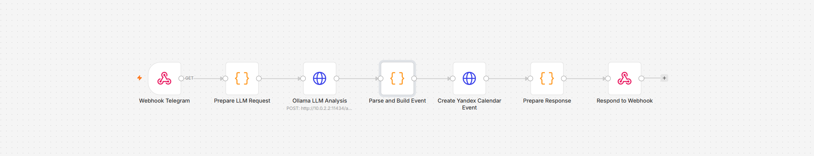
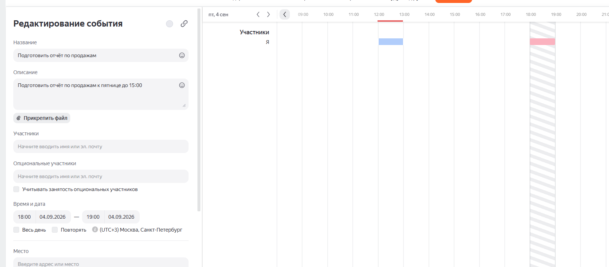
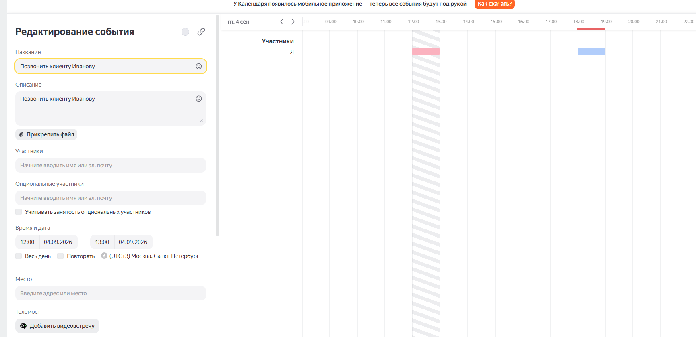
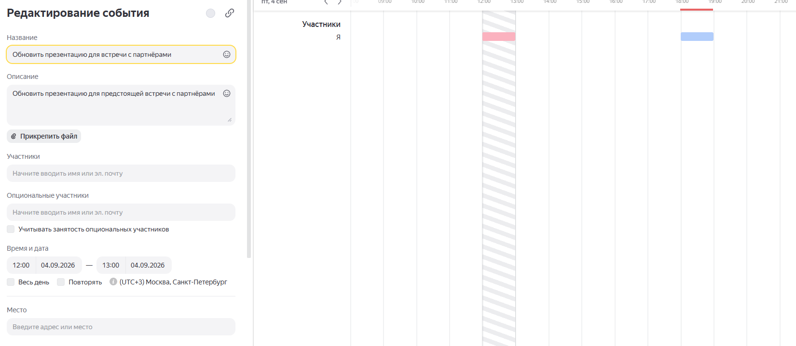
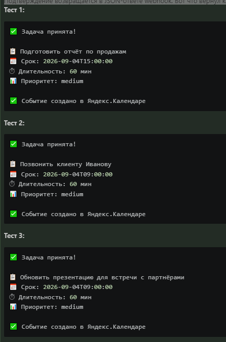

1. Общая информация
●	ФИО: Ражев Михаил Николаевич
●	Какие инструменты использованы: [Webhook + n8n +  Яндекс календарь]
●	Какая система для создания задач использована: [Яндекс календарь]
●	Какая ИИ-модель или AI-нода использована для обработки текста: [GLM 5.2]

2. Скриншот workflow
Вставьте скриншот workflow в n8n, где видны основные узлы сценария.
На скриншоте должны быть видны шаги: получение сообщения → обработка текста → извлечение задачи и срока → создание задачи → уведомление пользователю.



3. Скриншоты входящих поручений
Вставьте 2–3 скриншота сообщений, которые вы отправляли боту для проверки сценария.

Тест 1 (точный срок):__

```bash
curl.exe -s -G "http://192.168.56.50:5678/webhook/task-agent" --data-urlencode "message=Напомни подготовить отчёт по продажам к пятнице до 15:00"
```

Тест 2 (относительный срок):__

```bash
curl.exe -s -G "http://192.168.56.50:5678/webhook/task-agent" --data-urlencode "message=Позвонить клиенту Иванову завтра утром"
```

Тест 3 (без срока):__

```bash
curl.exe -s -G "http://192.168.56.50:5678/webhook/task-agent" --data-urlencode "message=Надо обновить презентацию для встречи с партнёрами"
```


4. Скриншоты результата
Вставьте скриншоты, которые подтверждают, что задача или событие были созданы в календаре или системе задач

- Подготовить отчёт по продажам (04.09 18:00 МСК)


- Позвонить клиенту Иванову (04.09 12:00 МСК)


- Обновить презентацию (04.09 12:00 МСК)


5. Скриншоты уведомления или подтверждения
Вставьте скриншот напоминания, которое отправляет агент

Подтверждение возвращается в JSON-ответе webhook. Вот что вернул каждый тест (это и есть «уведомление от агента»):



## 6. Краткое описание решения

__Как работает сценарий:__

Пользователь отправляет текстовое поручение через HTTP-запрос (GET) на Webhook-эндпоинт n8n `http://192.168.56.50:5678/webhook/task-agent?message=…`. Webhook-узел принимает запрос и передаёт его в Code-узел «Prepare LLM Request», который извлекает текст сообщения, вычисляет текущую дату/время в часовом поясе UTC+3 (Москва) и формирует системный промпт. Затем HTTP Request-узел отправляет POST-запрос на локальный сервер Ollama (`http://10.0.2.2:11434/api/chat`, модель `glm-5.2:cloud`), который анализирует текст и возвращает JSON с извлечёнными данными. Code-узел «Parse and Build Event» парсит ответ LLM, строит iCalendar-событие (VEVENT) и вычисляет URL и Basic Auth-заголовок для CalDAV. Code-узел «Create Yandex Calendar Event» выполняет PUT-запрос к `https://caldav.yandex.ru` через `this.helpers.httpRequest()`, создавая событие в Яндекс.Календаре. После этого Code-узел «Prepare Response» формирует подтверждение, а узел «Respond to Webhook» возвращает JSON-ответ пользователю.

__Как происходит обработка текста:__

Текст поручения передаётся в LLM Ollama вместе с системным промптом, содержащим текущую дату/время и правила извлечения сущностей. LLM анализирует естественный язык, распознаёт относительные сроки («завтра утром», «к пятнице до 15:00», «через 3 дня») и возвращает структурированный JSON. Code-узел дополнительно страхует: если LLM не вернёт дедлайн, подставляется «завтра 09:00» по умолчанию.

__Как настроено уведомление / напоминание:__

Уведомление реализовано двумя механизмами: (1) событие с датой начала (DTSTART) и длительностью (DTEND) создаётся в Яндекс.Календаре — Яндекс.Календарь автоматически показывает напоминание о предстоящем событии; (2) пользователю мгновенно возвращается текстовое подтверждение через Respond to Webhook — с названием задачи, сроком, длительностью, приоритетом и статусом создания в календаре (✅).

__Какие данные извлекаются из сообщения:__

- __Задача__ — `task_name`: краткое название (что нужно сделать), например «Подготовить отчёт по продажам»
- __Срок__ — `deadline`: дата и время в формате ISO 8601 (UTC+3), например `2026-09-04T15:00:00`
- Дополнительно: `duration_minutes` (длительность, по умолчанию 60 мин), `description` (контекст), `priority` (high / medium / low, по умолчанию medium)

---

## 7. Проверка работоспособности

__Тест 1__

- __Входящее поручение:__ `Напомни подготовить отчёт по продажам к пятнице до 15:00`
- __Что получилось:__ LLM извлёк задачу «Подготовить отчёт по продажам» со сроком `2026-09-04T15:00:00` (пятница 15:00). Событие создано в Яндекс.Календаре — HTTP-ответ от CalDAV: __201 Created__. Пользователю возвращено подтверждение со статусом «✅ Событие создано в Яндекс.Календаре».

__Тест 2__

- __Входящее поручение:__ `Позвонить клиенту Иванову завтра утром`
- __Что получилось:__ LLM распознал относительный срок «завтра утром» → `2026-09-04T09:00:00`. Задача «Позвонить клиенту Иванову», приоритет medium, длительность 60 мин. Событие создано в Яндекс.Календаре — __HTTP 201 Created__.

__Тест 3__

- __Входящее поручение:__ `Надо обновить презентацию для встречи с партнёрами`
- __Что получилось:__ Срок в сообщении не указан — LLM применил правило по умолчанию → `2026-09-04T09:00:00` (завтра 09:00). Задача «Обновить презентацию для встречи с партнёрами», описание сохранено. Событие создано в Яндекс.Календаре — __HTTP 201 Created__.

---

## 8. Итог проверки

- __Корректно ли создаются задачи: да__ — все 3 тестовых поручения обработаны успешно, события реально созданы в Яндекс.Календаре (HTTP 201 Created от CalDAV-сервера для каждого). Названия задач извлекаются корректно и сохраняются в поле SUMMARY iCalendar-события.

- __Корректно ли распознаётся срок: да__ — точная дата («к пятнице до 15:00» → пятница 15:00), относительный срок («завтра утром» → завтра 09:00) и отсутствие срока (→ завтра 09:00 по умолчанию) — все три варианта распознаны верно. Часовой пояс UTC+3 (Москва) учитывается при конвертации в UTC для iCalendar.

- __Отправляется ли подтверждение или напоминание: да__ — после создания события пользователю возвращается JSON-ответ с текстовым подтверждением (название задачи, срок, длительность, приоритет, статус календаря). Само событие в Яндекс.Календаре служит напоминанием — Яндекс.Календарь отображает предстоящие события и уведомляет о них.


