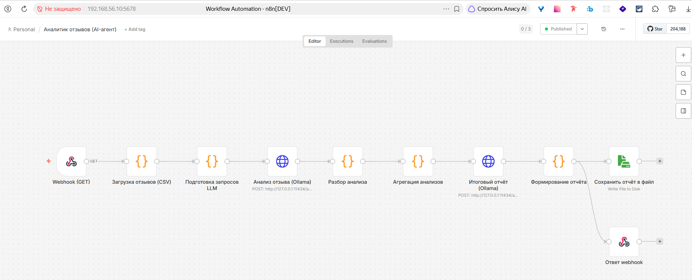
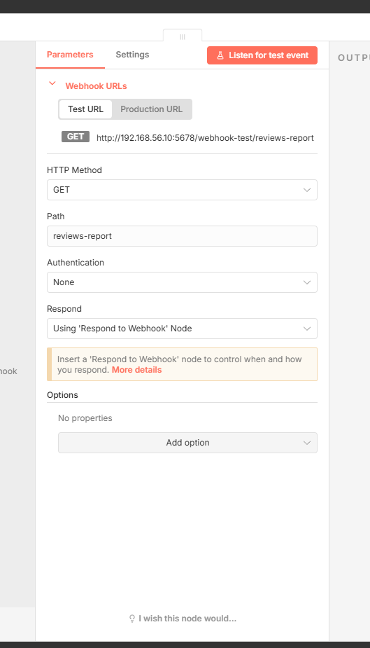
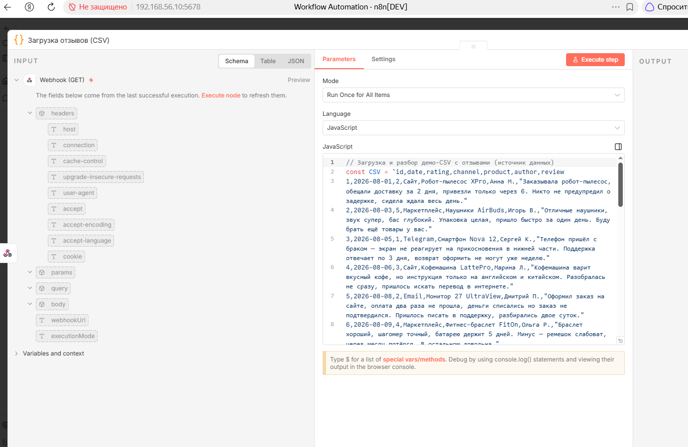
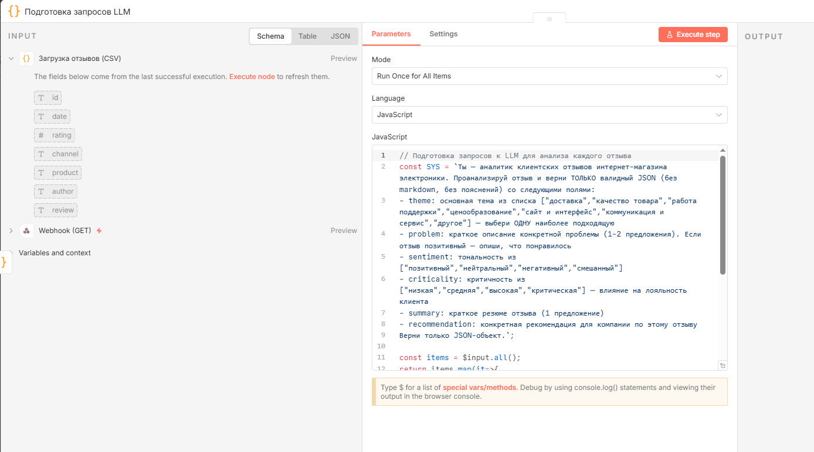
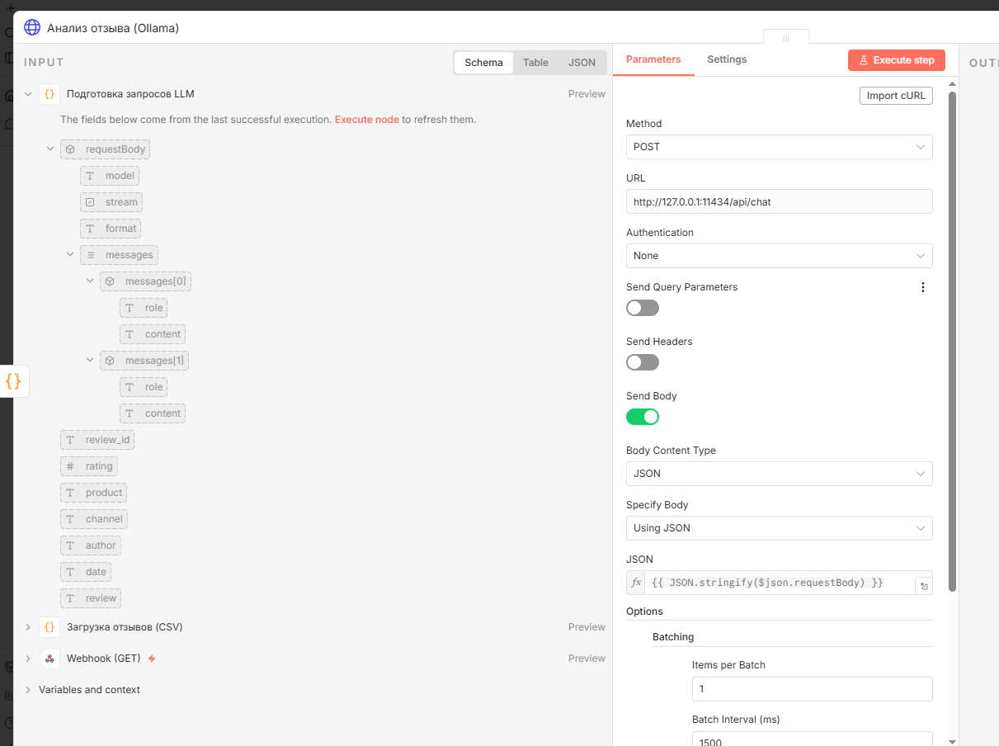
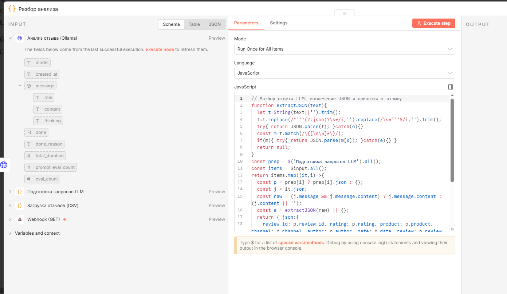
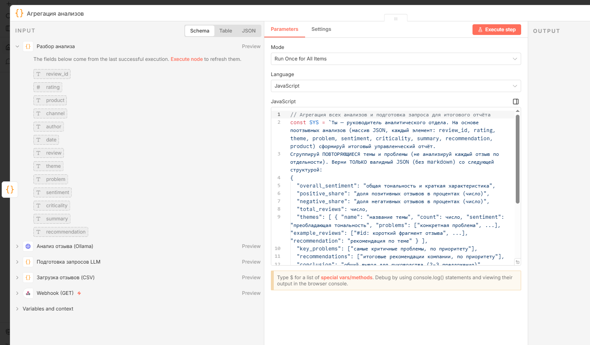
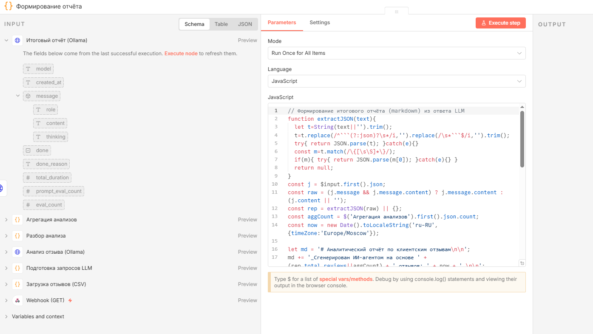
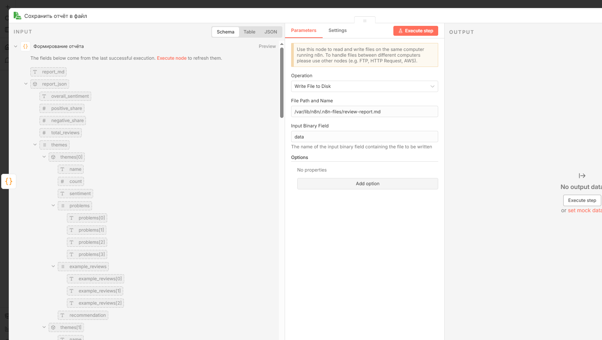
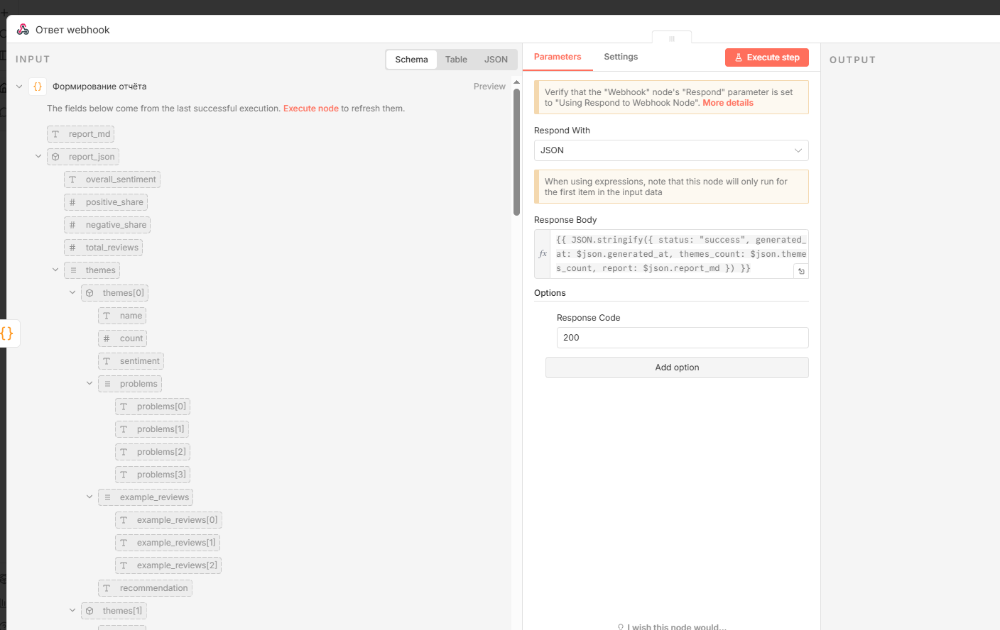

1. Общая информация
●	ФИО: Ражев Михаил Николаевич

## 2. Реализация сценария

**Как именно работает сценарий**

Сценарий запускается по Webhook (GET) `http://192.168.56.10:5678/webhook/reviews-report` и проходит цепочку из 8 узлов:

1. **Загрузка отзывов (CSV)** — Code-нода разбирает встроенный CSV (15 демо-отзывов) собственным парсером (с учётом кавычек и запятых внутри полей). На выходе — 15 структурированных записей `{id, date, rating, channel, product, author, review}`.
2. **Подготовка запросов LLM** — для каждого отзыва формируется JSON-тело запроса к Ollama (`POST /api/chat`, модель `glm-5.2:cloud`, `format:'json'`) с системным промптом аналитика.
3. **Анализ отзыва (Ollama)** — HTTP Request к локальной Ollama (доступна через обратный SSH-туннель с Windows-хоста). Включён батчинг `batchSize:1, batchInterval:1500ms`, чтобы обойти rate-limit облачной модели (без него — 429 «too many concurrent requests»).
4. **Разбор анализа** — извлекает JSON из ответа LLM (с очисткой от ```json-обёрток и regex-фолбэком `/{...}/`), привязывает результат к конкретному отзыву.
5. **Агрегация анализов** — собирает все 15 анализов в один массив и формирует запрос для итогового отчёта (промпт руководителя аналитики).
6. **Итоговый отчёт (Ollama)** — второй вызов LLM, генерирует сводный управленческий отчёт.
7. **Формирование отчёта** — Code-нода преобразует JSON от LLM в Markdown.
8. **Сохранить отчёт в файл** (запись в `/var/lib/n8n/.n8n-files/review-report.md`) **+ Ответ webhook** — нода `respondToWebhook` возвращает клиенту JSON `{status, generated_at, themes_count, report}`.

**Задачи, которые решает на тестовом наборе (15 отзывов):**
- поотзывной анализ через LLM: тема, проблема, тональность, критичность, резюме, рекомендация;
- группировка повторяющихся тем (а не перечисление каждого отзыва отдельно);
- расчёт долей позитивных/негативных отзывов (20% / 53%);
- генерация итогового отчёта для руководства.

**Проблемы и темы, которые умеет выделять:**
- **качество товара** (6) — нет рус. инструкции, износ ремешка, несоответствие характеристик, запах пластика;
- **работа поддержки** (3) — ответы по 3 дня, затягивание возврата, противоречивые советы, платный сервис-центр;
- **доставка** (3) — задержки до 4–6 дней, нет уведомлений, звонок за 10 минут, помятая упаковка;
- **сайт и интерфейс** (1) — перегруженный чекаут;
- **ценообразование** (1) — цена выше конкурентов;
- **коммуникация и сервис** (1) — удачный кейс подбора менеджером.

**Формат итогового отчёта** — Markdown:
- заголовок + дата генерации;
- общая тональность + доли позитив/негатив (%);
- сгруппированные темы: для каждой — кол-во отзывов, тональность, список проблем, примеры с `#id` и фрагментами, рекомендация;
- ключевые проблемы по приоритету;
- итоговые рекомендации по приоритету;
- заключение.

По webhook отчёт также доступен в виде JSON `{status, generated_at, themes_count, report}` (поле `report` содержит полный Markdown).

-------------------------------------------------------------------------


## 3. Workflow — основные ноды и их функции

Общая схема



| Триггер | **Webhook (GET)** | Принимает GET-запрос по пути `reviews-report`, запускает сценарий | HTTP GET-запрос | Пустой item, запускает цепочку |


| Нода 1. Получение данных | **Загрузка отзывов (CSV)** | Разбирает встроенный CSV собственным парсером (кавычки/запятые внутри полей) | Триггер | 15 записей `{id, date, rating, channel, product, author, review}` |



| Нода 2. Анализ отзыва через LLM | **Подготовка запросов LLM** + **Анализ отзыва (Ollama)** | Формирует запрос к LLM для каждого отзыва (промпт SYS1) и вызывает Ollama с батчингом | 15 записей отзывов | 15 ответов LLM (raw JSON в `message.content`) |



| Нода 3. Группировка проблем | **Разбор анализа** + **Агрегация анализов** | Извлекает JSON из ответов, собирает все 15 анализов в единый массив, формирует запрос для итоговой группировки (промпт SYS2) | 15 ответов LLM | 1 агрегированный запрос на сводный отчёт |



| Нода 4. Формирование итогового отчёта | **Итоговый отчёт (Ollama)** + **Формирование отчёта** | LLM генерирует сводный отчёт с группировкой тем; Code-нода преобразует JSON в Markdown | Агрегированный запрос | Markdown-отчёт + JSON `{report_md, report_json, generated_at, themes_count}` |


| Запись / ответ | **Сохранить отчёт в файл** + **Ответ webhook** | Записывает `.md` на диск и возвращает JSON-ответ клиенту | Markdown-отчёт | Файл `review-report.md` + HTTP-ответ `{status, generated_at, themes_count, report}` |



**Запускается сценарий:**
- **автоматически** — по Webhook (GET). Production URL: `http://192.168.56.10:5678/webhook/reviews-report`.
- Пояснение: workflow активирован штатно (через внутренний API n8n), webhook зарегистрирован в `webhook_entity`. Любой GET-запрос к URL запускает полный сценарий; ответ возвращается через ноду `respondToWebhook` (~75 секунд на LLM-анализ). Запуск: `curl "http://192.168.56.10:5678/webhook/reviews-report"`.

-------------------------------------------------------------------------


## 4. Обработка отзывов

**Какие данные реально использовались в анализе**

Из CSV использовались поля: `id`, `date`, `rating`, `channel`, `product`, `author`, `review`. В промпт LLM передаются: `id`, `rating`, `channel`, `product`, `author`, `date`, `review`. Поле `review` — основной текст для анализа; `rating` и `channel` — контекст.

**Пример исходных данных:**

| id | date | rating | channel | product | author | review |
|----|------|--------|---------|---------|--------|--------|
| 1 | 2026-08-01 | 2 | Сайт | Робот-пылесос XPro | Анна М. | Заказывала робот-пылесос, обещали доставку за 2 дня, привезли только через 6. Никто не предупредил о задержке, сидела ждала весь день. |
| 3 | 2026-08-05 | 1 | Telegram | Смартфон Nova 12 | Сергей К. | Телефон пришёл с браком — экран не реагирует на прикосновения в нижней части. Поддержка отвечает по 3 дня, возврат оформить не могут уже неделю. |
| 15 | 2026-08-24 | 5 | Маркетплейс | Зеркальная камера PhotoMax | Юлия А. | Прекрасный магазин! Цена ниже рынка, камера оригинальная, проверила по серийному номеру. Доставка точно в срок, курьер вежливый. Рекомендую! |

**Что сделано перед отправкой данных в LLM:**
- CSV разобран собственным парсером в Code-ноде (корректная обработка кавычек и запятых внутри полей `review`);
- поля приведены к типам (`rating` → число, `id` → строка);
- для каждого отзыва собрано единое текстовое сообщение (user-prompt): `Отзыв #id | рейтинг: N/5 | канал: ... | товар: ... | автор: ... | дата: ...` + текст отзыва;
- включён батчинг `batchSize:1, batchInterval:1500ms` — запросы идут по одному с интервалом, чтобы обойти rate-limit облачной модели;
- запрос отправляется с `format:'json'` — Ollama принудительно возвращает валидный JSON.

**Что сценарий считает шумом:**
- пустые строки CSV (пропускаются парсером);
- отзывы без конкретной проблемы (чисто восторженные, например #15) — они попадают в тему «коммуникация и сервис» как позитивный кейс и не порождают «проблем»;
- субъективные оценки, не подкреплённые фактом (например «не понравилось») — промпт требует описать **конкретную** проблему;
- пунктуация/опечатки (например «прикосновения» в отзыве #3) — не влияют на анализ, LLM понимает смысл.

**Какой результат возвращается по одному отзыву:**

После ноды «Разбор анализа» каждый отзыв получает структуру:
```json
{
  "review_id": "3",
  "rating": 1,
  "product": "Смартфон Nova 12",
  "channel": "Telegram",
  "author": "Сергей К.",
  "date": "2026-08-05",
  "review": "Телефон пришёл с браком ...",
  "theme": "качество товара",
  "problem": "Телефон пришёл с браком — экран не реагирует на прикосновения в нижней части; поддержка отвечает по 3 дня и не может оформить возврат уже неделю.",
  "sentiment": "негативный",
  "criticality": "критическая",
  "summary": "Бракованный товар и некомпетентная поддержка делают возврат невозможным.",
  "recommendation": "Заменить бракованный товар, ускорить оформление возврата и улучшить SLA поддержки."
}
```

**Как в сценарии группируются проблемы:**

Группировка выполняется вторым вызовом LLM (промпт SYS2): все 15 поотзывных анализов передаются одним массивом, и LLM объединяет похожие жалобы в общие категории по теме (`theme`). Для каждой группы считаются: количество отзывов, преобладающая тональность, сводный список проблем, примеры с `#id` и рекомендация. Таким образом повторяющиеся темы (например «доставка» встречается у #1, #8, #14) схлопываются в одну категорию, а не перечисляются по отдельности.

**Как определяется значимость проблемы:**
- **Когда проблема считается повторяющейся:** когда 2 и более отзыва попадают в одну группу `theme` и описывают схожую проблему (например задержка доставки у #1, #8, #14). Количество `count` в группе = число таких отзывов.
- **Как сценарий отличает факт из отзыва от интерпретации:** промпт SYS1 требует описать **конкретную** проблему из текста (1–2 предложения), а не домыслы; в итоговый отчёт попадают `example_reviews` с `#id` и прямым фрагментом текста — это первоисточник, а не пересказ. Сводные «проблемы» в группе — обобщение нескольких фактов.
- **В каких случаях результат нужно проверять вручную:** когда LLM присваивает `theme: "другое"` (не удалось классифицировать); когда `criticality: "критическая"` (высокое влияние на лояльность — стоит перепроверить); когда извлечение JSON не удалось (поле пустое, дефолт `другое`); при низкой уверенности/смешанной тональности.

---


## 5. Промпт и логика анализа

**Промпт для анализа одного отзыва (SYS1):**

```
Ты — аналитик клиентских отзывов интернет-магазина электроники. Проанализируй отзыв и верни ТОЛЬКО валидный JSON (без markdown, без пояснений) со следующими полями:
- theme: основная тема из списка ["доставка","качество товара","работа поддержки","ценообразование","сайт и интерфейс","коммуникация и сервис","другое"] — выбери ОДНУ наиболее подходящую
- problem: краткое описание конкретной проблемы (1-2 предложения). Если отзыв позитивный — опиши, что понравилось
- sentiment: тональность из ["позитивный","нейтральный","негативный","смешанный"]
- criticality: критичность из ["низкая","средняя","высокая","критическая"] — влияние на лояльность клиента
- summary: краткое резюме отзыва (1 предложение)
- recommendation: конкретная рекомендация для компании по этому отзыву
Верни только JSON-объект.
```

**Промпт для итогового отчёта (SYS2):**

```
Ты — руководитель аналитического отдела. На основе поотзывных анализов (массив JSON, каждый элемент: review_id, rating, theme, problem, sentiment, criticality, summary, recommendation, product) сформируй итоговый управленческий отчёт.
Сгруппируй ПОВТОРЯЮЩИЕСЯ темы и проблемы (не анализируй каждый отзыв по отдельности). Верни ТОЛЬКО валидный JSON (без markdown) со следующей структурой:
{
  "overall_sentiment": "общая тональность и краткая характеристика",
  "positive_share": "доля позитивных отзывов в процентах (число)",
  "negative_share": "доля негативных отзывов в процентах (число)",
  "total_reviews": число,
  "themes": [ { "name": "название темы", "count": число, "sentiment": "преобладающая тональность", "problems": ["конкретная проблема", ...], "example_reviews": ["#id: короткий фрагмент отзыва", ...], "recommendation": "рекомендация по теме" } ],
  "key_problems": ["самые критичные проблемы, по приоритету"],
  "recommendations": ["итоговые рекомендации компании, по приоритету"],
  "conclusion": "общий вывод для руководства (2-3 предложения)"
}
Верни только JSON.
```

**Как промпт работает в реализации:**
- **выделение проблем** — поле `problem` в SYS1 (конкретная проблема 1–2 предложения) и массив `problems` + `key_problems` в SYS2;
- **эмоциональный тон** — поле `sentiment` в SYS1 (4 класса) и `overall_sentiment` + `positive_share`/`negative_share` в SYS2;
- **группировка тем** — поле `theme` в SYS1 (закрытый список из 7 значений) обеспечивает единый словарь тем, а SYS2 явно требует «Сгруппируй ПОВТОРЯЮЩИЕСЯ темы» и формирует массив `themes` с `count`;
- **снижение риска галлюцинаций** — закрытый список `theme` (модель не придумывает новые категории), требование «опиши конкретную проблему из текста», `example_reviews` с `#id` и прямым фрагментом (первоисточник), `format:'json'` (структурированный вывод), и双层 промпт: SYS1 работает строго с одним отзывом, SYS2 — только с уже извлечёнными фактами, а не с исходным текстом.

---

## 6. Результат работы сценария

**Какие выводы получились именно у вас (основные проблемы):**
- **работа поддержки** — медленные ответы (до 3 дней), затягивание возврата брака, противоречивые советы разных операторов, отправка клиента в платный сервис-центр (#3, #5, #12);
- **доставка** — систематические задержки до 4–6 дней, отсутствие уведомлений о задержках и времени прибытия, звонок курьера за 10 минут, помятая упаковка и невежливость курьера (#1, #8, #14);
- **несоответствие характеристик товара** — время кипячения, ёмкость аккумулятора, отсутствие рус. инструкции, износ ремешка, запах пластика (#4, #6, #10, #11);
- **сбои сайта и ценообразование** — двойное списание средств, перегруженный чекаут, цена выше конкурентов (#5, #7, #13).

**Какой эмоциональный фон выявил сценарий:**

Преобладает негативная и смешанная тональность. Клиенты часто сталкиваются с задержками доставки, медленной работой поддержки и несоответствием характеристик товаров заявленным. Позитивные отзывы связаны в основном с качеством самих товаров и отдельными сотрудниками. **Позитивных: 20% • Негативных: 53%.**

**Примеры, подтверждающие выводы:**
- #1: «Заказывала робот-пылесос, обещали доставку за 2 дня, привезли только через 6. Никто не предупредил о задержке, сидела ждала весь день.»
- #3: «Телефон пришёл с браком — экран не реагирует на прикосновения в нижней части. Поддержка отвечает по 3 дня, возврат оформить не могут уже неделю.»
- #12: «Поддержка вообще не решила проблему — два разных оператора давали противоположные советы, в итоге отправили в сервисный центр за свой счёт. Ужасное отношение.»
- #8: «Доставка опять задержалась на 4 дня. Это уже второй раз за месяц. Курьер позвонил за 10 минут до прибытия, я не успела приехать домой.»
- #11: «Аккумулятор работает, заряжает телефон 3 раза. Но заявленная ёмкость 20000 мАч, по факту хватает на 2.5 заряда. Завышены характеристики.»


Итоговый отчёт
files/review-report.md

---


