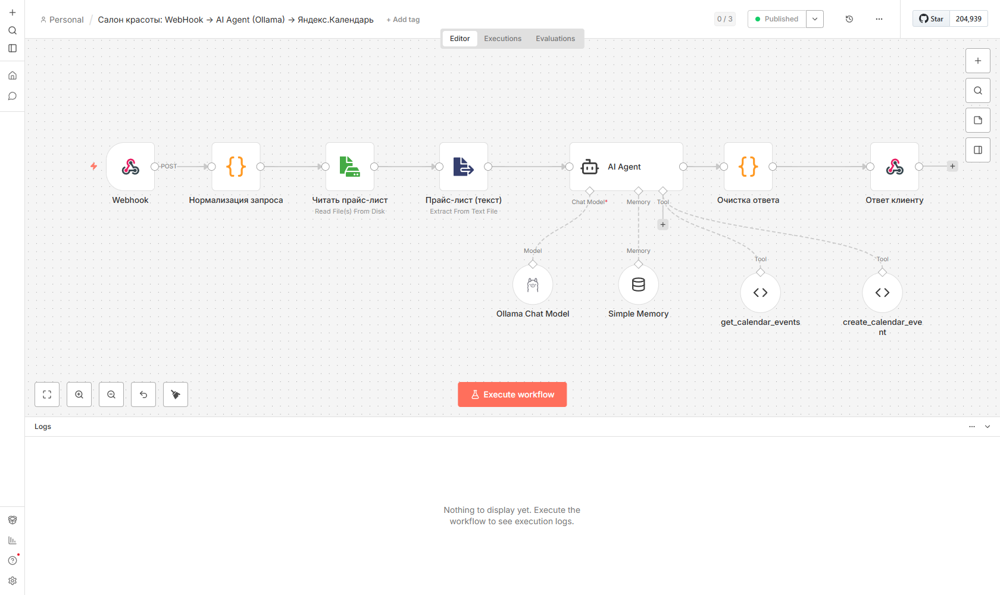
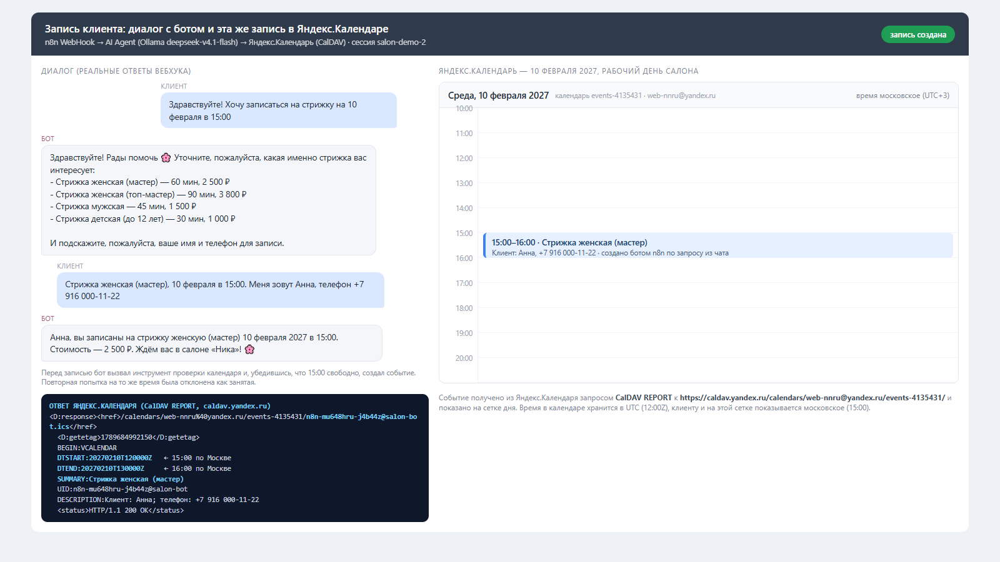

Скриншот №1, на котором чётко виден интерфейс n8n и полный workflow со всеми узлами и их связями.

Скриншот №2, на котором чётко виден полный диалог с ботом, демонстрирующий успешный сценарий записи и запись его в яндекс кадендарь.

workflow выгружен в файл files/workflow-salon-bot.json 

План действий

### Шаг 1. Подготовить прайс-лист
Сделали текстовый файл с услугами салона (название, длительность, цена) и положили
его на сервер: `/var/lib/n8n/.n8n-files/pricelist.md`.
Копия файла лежит рядом с этой инструкцией — `pricelist.md`.

### Шаг 2. Собрать схему бота в n8n
Собрали цепочку из узлов:

1. **Webhook** — «входная дверь»: сюда приходит сообщение клиента
   (адрес `http://192.168.56.10:5678/webhook/salon-bot`, метод POST).
2. **Нормализация запроса** — вытаскивает из запроса текст сообщения и номер диалога (сессию).
3. **Читать прайс-лист** — читает файл с прайс-листом с диска сервера.
4. **Прайс-лист (текст)** — превращает файл в обычный текст.
5. **AI Agent** — «мозг»: модель из Ollama + память диалога + два инструмента календаря.
6. **Очистка ответа** — убирает из ответа модели служебные размышления.
7. **Ответ клиенту** — отправляет готовый текст обратно тому, кто написал.

### Шаг 3. Подключить модель и память
- **Модель:** `deepseek-v4.1-flash:cloud` из локальной Ollama, температура 0.2
  (чтобы отвечал стабильно и по делу).
- **Память:** узел Simple Memory на 15 сообщений; ключ — номер сессии из запроса.
  Благодаря этому клиент может не повторять услугу и дату в каждом сообщении.

### Шаг 4. Научить бота смотреть календарь
Сделали два инструмента (их модель вызывает сама, когда нужно):

| Инструмент | Что делает |
|---|---|
| `get_calendar_events` | Спрашивает у Яндекс.Календаря, что уже занято в выбранный день, и считает свободные окна с 10:00 до 21:00 по Москве |
| `create_calendar_event` | Создаёт запись в календаре: услуга, дата и время, длительность, имя и телефон клиента |

### Шаг 5. Написать инструкцию для модели (системный промпт)
В промпт заложили:
- кто она (администратор салона «Ника»);
- текущие дату и время по Москве;
- **полный текст прайс-листа** (подставляется автоматически из файла);
- порядок работы: определить услугу → определить дату → проверить календарь →
  если свободно, создать запись → подтвердить клиенту;
- правила: не выдумывать услуги и цены, не создавать запись без проверки календаря,
  помнить контекст, задавать не больше одного уточняющего вопроса.

### Шаг 6. Убрать «мысли» модели из ответа
Выбранная модель — «рассуждающая»: вместе с ответом клиенту она присылает
и цепочку своих размышлений (обычно на английском). Чтобы клиент этого не видел:
- в промпт добавили правило начинать ответ служебным значком `###`;
- узел **«Очистка ответа»** оставляет только текст после этого значка,
  а если значка нет — отбрасывает английские рассуждения.

### Шаг 7. Проверить на живых сообщениях
Отправили на вебхук несколько сообщений и убедились, что бот:
- знает прайс-лист (перечисляет услуги и цены из файла);
- проверяет календарь и создаёт запись;
- подтверждает запись и не путает занятые часы со свободными;
- помнит контекст диалога;
- не выдумывает услуги, которых нет в прайс-листе.

## Если нужно повторить с нуля

1. Установить n8n и подключить модель Ollama.
2. Создать файл прайс-листа на сервере.
3. Импортировать `workflow-salon-bot.json` (Workflows → Import from File).
4. Проверить, что в узлах подставлены доступы: Ollama и Basic Auth Яндекса.
5. Включить workflow и написать в вебхук первое сообщение.
